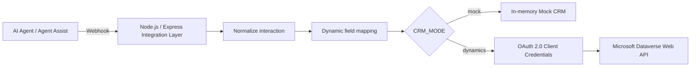

# AI Agent CRM Integration

A compact Node.js / Express reference project that shows how an AI Agent or Agent Assist workflow can push structured conversation data into a CRM through webhooks, dynamic field mapping and REST APIs.

This repository is a reference implementation focused on making common AI-to-CRM integration patterns explicit while remaining intentionally lightweight.

## Problem statement

Conversational AI applications often produce useful data during or after an interaction: transcript segments, summaries, next steps, qualification fields and suggested CRM updates. The challenge is connecting that evolving AI output to enterprise CRM records in a controlled and explainable way.

This project implements that integration layer:



## Key capabilities

- Receives cumulative AI Agent / Agent Assist webhook updates.
- Normalizes transcript segments, dynamic form fields and AI-generated outputs.
- Keeps only normalized interaction state in memory; raw webhook payloads are not exposed or persisted.
- Registers CRM context separately from the AI webhook (Task, Case and Opportunity IDs).
- Maps canonical AI fields to CRM logical names through `config/field-mappings.json`.
- Supports selective Opportunity updates.
- Provides two CRM modes:
  - `mock`: captures the PATCH operations in memory for a tenant-free demo.
  - `dynamics`: sends real PATCH requests to Microsoft Dynamics 365 / Dataverse.
- Uses OAuth 2.0 client credentials for Dataverse access in Dynamics mode.
- Protects webhook and API routes with a shared demo token.
- Includes a small browser UI for inspecting normalized interactions and triggering CRM actions.

## Technology stack

- Node.js 18+
- JavaScript (CommonJS)
- Express 5
- REST / JSON webhooks
- Microsoft Dataverse Web API v9.2
- OAuth 2.0 client credentials
- In-memory state for demo purposes

## Repository structure

```text
.
├── config/
│   ├── field-mappings.json
│   └── generation-labels.json
├── examples/
│   ├── crm-context.json
│   └── webhook-payload.json
├── public/
│   └── index.html
├── src/
│   ├── auth/
│   ├── crm/
│   ├── interactions/
│   ├── mappings/
│   └── utils/
├── test/
├── .env.example
├── requests.http
└── server.js
```

## Integration flow

1. A CRM-side workflow or orchestration layer registers the current CRM record IDs through `POST /api/interaction-context`.
2. The AI application sends an evolving interaction payload to `POST /webhook/agent-assist`.
3. The integration layer normalizes transcript, form values and AI generations into a canonical internal model.
4. Canonical fields are translated to CRM logical names through the mapping file.
5. In `mock` mode the write is stored in memory. In `dynamics` mode the same patch is sent to Dataverse.
6. Manual sync endpoints can re-apply Task, Case or Opportunity mappings for the active interaction.

The original integration pattern uses full/cumulative webhook updates. The latest normalized state replaces the previous state for the same interaction rather than appending duplicate transcript segments.

## Authentication approach

### Demo/API protection

All `/api/*` routes and the webhook require either:

```http
x-demo-token: <DEMO_API_TOKEN>
```

or the compatibility header `x-agentassist-token`, or:

```http
Authorization: Bearer <DEMO_API_TOKEN>
```

This authentication approach is intentionally simple. The token must be supplied through environment configuration and is never hardcoded in the repository.

### Microsoft Dynamics 365

When `CRM_MODE=dynamics`, the service obtains an access token from Microsoft Entra ID with the OAuth 2.0 client credentials grant and requests the Dataverse resource scope:

```text
https://<your-org>.crm.dynamics.com/.default
```

The token is cached in memory until shortly before expiration.

## Dynamic data mapping

`config/field-mappings.json` separates AI-facing canonical fields from Dataverse logical names.

Example:

```json
{
  "opportunity": {
    "entitySet": "opportunities",
    "fields": {
      "title": "name",
      "customerNeed": "new_customerneed",
      "nextSteps": "new_nextsteps"
    }
  }
}
```

The `new_*` fields are deliberately generic examples. A real Dataverse environment should replace them with the logical names defined in that tenant.

Opaque AI automation IDs can optionally be mapped to semantic labels in `config/generation-labels.json`. The public repository ships with an empty map so no environment-specific automation identifiers are exposed.

## Mock CRM mode

Mock mode is the default and requires no Dynamics tenant.

```bash
cp .env.example .env
npm install
npm start
```

Keep:

```text
CRM_MODE=mock
```

Then register the fictional CRM context and send the fictional webhook from `requests.http`, or use `curl`:

```bash
curl -X POST http://localhost:3000/api/interaction-context \
  -H "content-type: application/json" \
  -H "x-demo-token: YOUR_LOCAL_TOKEN" \
  --data @examples/crm-context.json

curl -X POST http://localhost:3000/webhook/agent-assist \
  -H "content-type: application/json" \
  -H "x-demo-token: YOUR_LOCAL_TOKEN" \
  --data @examples/webhook-payload.json
```

Inspect the resulting simulated CRM writes:

```bash
curl http://localhost:3000/api/mock-crm \
  -H "x-demo-token: YOUR_LOCAL_TOKEN"
```

The browser UI is available at `http://localhost:3000/`.

## Microsoft Dynamics 365 integration

Set:

```text
CRM_MODE=dynamics
DYNAMICS_BASE_URL=https://your-org.crm.dynamics.com
DYNAMICS_TENANT_ID=<tenant-guid>
DYNAMICS_CLIENT_ID=<application-guid>
DYNAMICS_CLIENT_SECRET=<secret>
```

The Entra application must be configured for the target Dataverse environment with appropriate application-user permissions. Update `config/field-mappings.json` so every custom field matches the target environment.

The project issues Dataverse PATCH requests to entity sets such as:

```text
/api/data/v9.2/tasks(<id>)
/api/data/v9.2/incidents(<id>)
/api/data/v9.2/opportunities(<id>)
```

## Webhook processing

A fictional payload is provided in `examples/webhook-payload.json`.

The normalizer currently understands the patterns used by the source prototype:

- `interaction_id`
- `transcript.segments`
- `object_completions.call_form`
- `generation_prompt_based`
- `automations`
- callback metadata containing a call ID

Example excerpt:

```json
{
  "interaction_id": "demo-interaction-001",
  "object_completions": {
    "call_form": {
      "qualification": {
        "customer_need": "Automate support request routing"
      }
    }
  },
  "automations": {
    "interaction-summary": "The customer is evaluating conversational AI..."
  }
}
```

No real transcripts, customer data, automation IDs or internal payloads are included.

## API endpoints

| Method | Endpoint | Purpose |
| --- | --- | --- |
| `GET` | `/health` | Public service health check |
| `POST` | `/webhook` or `/webhook/agent-assist` | Receive and normalize AI interaction updates |
| `POST` | `/api/interaction-context` | Register CRM record IDs for an interaction |
| `GET` | `/api/active-interaction` | Inspect the active normalized interaction |
| `GET` | `/api/latest-interaction` | Inspect the latest normalized interaction |
| `GET` | `/api/interactions` | List normalized interactions |
| `GET` | `/api/interactions/:id` | Inspect one normalized interaction |
| `POST` | `/api/interactions/:id/sync-task` | Apply Task mapping |
| `POST` | `/api/interactions/:id/sync-case` | Apply Case mapping |
| `POST` | `/api/interactions/:id/sync-opportunity` | Apply Opportunity mapping |
| `GET` | `/api/mock-crm` | Inspect simulated writes in mock mode |

## Configuration

Copy the example environment file:

```bash
cp .env.example .env
```

Important settings:

| Variable | Description |
| --- | --- |
| `PORT` | HTTP port |
| `CRM_MODE` | `mock` or `dynamics` |
| `DEMO_API_TOKEN` | Shared token protecting webhook/API routes |
| `INTERACTION_TTL_MINUTES` | How long the latest interaction is considered active |
| `CRM_FIELD_MAPPING_FILE` | Path to the CRM mapping JSON |
| `GENERATION_LABELS_FILE` | Optional opaque-generation-ID mapping |
| `DYNAMICS_*` | Dataverse credentials and base URL for Dynamics mode |

## Security considerations

This repository intentionally implements a reasonable demo security baseline rather than production-grade controls:

- Secrets are environment-only; `.env` is ignored by Git.
- No default API/webhook secret is embedded in source code.
- Sensitive API routes require authentication.
- Raw incoming webhook payloads are neither persisted nor exposed through a debug endpoint.
- Logs include interaction IDs and operational counts, not transcripts, contact fields, tokens or CRM payload bodies.
- Express request bodies are capped at 2 MB.
- Browser/API responses use `no-store` for API data and basic security headers.
- Dynamics OAuth errors do not print token responses or credentials.
- Cross-origin access is not enabled by default; the demo UI is served from the same Express origin.

For production, add stronger identity/authentication, signature validation or mTLS for webhooks, durable storage, rate limiting, centralized secrets management, audit logging, retry/idempotency controls and tenant-specific authorization.

## Validation

```bash
npm run check
npm test
```

## Limitations

- In-memory interaction state is lost on restart.
- Mock CRM mode demonstrates outbound writes but is not a CRM emulator.
- Field semantics are intentionally generic; every Dataverse tenant needs its own mapping.
- The incoming AI payload schema is representative of the source prototype, not a universal Agent Assist standard.
- No retry queue or dead-letter mechanism is implemented.

## Possible extensions

- Webhook signature verification and replay protection.
- JSON-schema validation for provider-specific webhook contracts.
- Persistent event store and idempotency keys.
- Admin UI for editing field mappings.
- Additional CRM adapters (Salesforce, HubSpot, Zoho).
- Queue-based processing for higher-volume event-driven integrations.
- OpenTelemetry traces and structured observability.

## License

MIT
